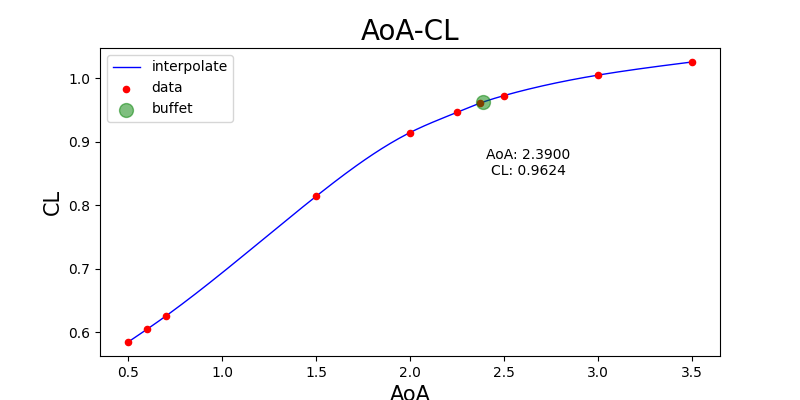
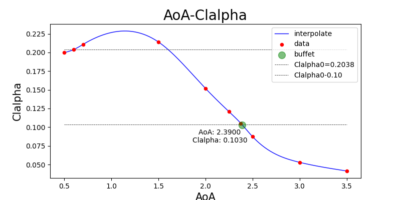

# AoABuffet-FluentBackend

A repository using python to find buffet AoA with fluent as backend.

## Introduction

This repository is used to find the buffet AoA using `fluent` as backend. The main idea is to use fluent to calculate the lift coefficient of the wing with different AoA, and then use the lift coefficient to find the buffet AoA.

This repository originally used `CFL3D` as backend, but the convergence of `CFL3D` is not good enough, so we changed to `fluent` as an alternative.

RunZe Li from Tsinghua University developed original code version. However his code only works for low reynolds number and the robustness of the code is not good enough. So I rewrote the code for high reynolds number and improved the robustness of the code.

A better way to do this job is to use `pyFluent`. However, this package only supports for `fluent` version above `2022`. As a result, we have to activate the `fluent` via `cmd`. Moreover, for this code will be run for several working condition at the same time, I activate the `fluent` and kill the task when one calculation is done. This is not a good way to do this job, but it will not crash on multiple-working-condition situation.

## What's Buffet AoA

Usually, the angle of attack $\alpha$'s relationship with the lift coefficient $C_L$ is like this:

$$
\begin{equation}
  \begin{aligned}
    C_L = f(\alpha)=C_{l\alpha}(\alpha-\alpha_0)
  \end{aligned}
\end{equation}
$$

This linear relationship only works for small AoA. When the AoA is large enough, the lift coefficient will decrease. This is called buffet. The buffet AoA is the AoA when the lift coefficient starts to decrease.

From the code provided by RunZe Li, we can see that the buffet AoA locates where the derivative of $C_L$ is $0.1$ smaller than the $C_{l\alpha 0}$:

$$
\begin{equation}
  \begin{aligned}
    \frac{dC_L}{d\alpha}\left(AoA_{buffet}\right)
    = C_{l\alpha}\left(AoA_{buffet}\right) 
    = C_{l\alpha 0} - 0.1
  \end{aligned}
\end{equation}
$$

## Usage

### Requirements

- `python3`
- license of `fluent`
- packages:
  - `numpy`
  - `pandas`
  - `fsspec`
  - `tabulate`
  - `scipy`
  - `matplotlib`

### How to Run

1. First, locate where the `fluent` is installed. And modify `config//fluent_settings.json` at `fluent exe`.
2. Second, decide the number of thread you prefer to use. And modify `config//fluent_settings.json` at `thread number`.
3. Third, for `fluent` will produce a lot of files, we need to decide where to store these files. Modify `config//calculate_settings.json` at `calculation data path`.
4. Fourth, you can see `examples` folder. There are 3 folders in it. A jupyer notebook in it will show you how to use the code.

### An Example

In `examples/001t010mach0.76/`, the notebook show you theses steps:

#### Specify an `AoAFinder`

```python
from src.classes.AoAFinder import AoAFinder
aoa_finder: AoAFinder = AoAFinder()
mesh_filename: str = "C://AoABuffet-FluentBackend//Mesh//001t010.cas"
mach: float = 0.76
aoa_finder.setMeshFilename(mesh_filename)
aoa_finder.setMach(mach)
```

As is shown above, we define an `AoAFinder` and specify the mesh file and the mach number.

#### Find Buffet AoA `autoCalculate`

```python
aoa_finder.autoCalculate()
```

This function is equal to the following steps:

```python
aoa_finder.calculateClalpha0()
# calculate the lift coefficient at chosen AoA seen in `config//aoa_finder_settings.json` at `Clalpha0` - `sample points`
aoa_finder.locateWhereBuffet()
# search from 1.5 with step 1.0, seen in `config//aoa_finder_settings.json` at `where buffet`
aoa_finder.refineWhereBuffet()
# use binary search to find the buffet AoA until tolerance, seen in `config//aoa_finder_settings.json` at `tolerance`
aoa_finder.interpolate()
# interpolate the buffet AoA, seen in `config//aoa_finder_settings.json` at `interpolation sample points`
aoa_finder.getAoABuffet()
# finally, get the buffet AoA
```

After running code above, you can see the buffet AoA at `aoa_finder.AoA_buffet`, the lift coefficient at buffet AoA at `aoa_finder.CL_buffet` and `aoa_finder.Clalpha_buffet`.

Main part of `aoa_finder.dataframe` is shown below:

|    |   mach |   AoA |       CL |   Clalpha |        CD |   iterations |
|---:|-------:|------:|---------:|----------:|----------:|-------------:|
|  0 |   0.76 | 0.5   | 0.584783 | 0.199804  | 0.0102155 |         2500 |
|  1 |   0.76 | 0.6   | 0.604763 | 0.203803  | 0.0106987 |         2500 |
|  2 |   0.76 | 0.7   | 0.625543 | 0.210884  | 0.010264  |         2500 |
|  3 |   0.76 | 1.5   | 0.813983 | 0.214061  | 0.0141604 |         2500 |
|  4 |   0.76 | 2     | 0.914298 | 0.151843  | 0.0214976 |         2500 |
|  5 |   0.76 | 2.25  | 0.94616  | 0.120695  | 0.0260696 |         2500 |
| 18 |   0.76 | 2.375 | 0.960825 | 0.105129  | 0.0285024 |         2500 |
|  6 |   0.76 | 2.5   | 0.972443 | 0.0872455 | 0.0308279 |         2500 |
|  7 |   0.76 | 3     | 1.00468  | 0.0528871 | 0.0404122 |         2500 |
|  8 |   0.76 | 3.5   | 1.02533  | 0.0413072 | 0.0495729 |         2500 |

#### Plot the Results

```python
aoa_finder.drawAoACL()
aoa_finder.drawAoAClalpha()
```

After running code above, you will get 2 `plt.Figure()` objects as `aoa_finder.figure_AoACL` and `aoa_finder.figure_AoAClalpha`.

Although it's better to write plot settings in a `json` file, I didn't realy do that for figures are not that important. You can still modify the plot settings in `src//classes//AoAFinder.py` at `drawAoACL` and `drawAoAClalpha`.

Below is 2 figures as an example of the code (seen in `examples/001t010mach0.76/`):





## My Method

For calculation via `fluent` still takes a lot of time, I try to minimize the number of calculation. So I use the following method to find the buffet AoA.

### Find $C_{l\alpha 0}$

First, I use `fluent` to calculate the lift coefficient at chosen AoA. Then I use `scipy` to fit the lift coefficient to a linear function. The slope of the linear function is $C_{l\alpha 0}$.

This procedure can be found in `src//classes//AoAFinder.py` at `calculateClalpha0`.

### Locate Where Buffet

Second, from $AoA=1.5^\circ$ with step $1.0$, I use `fluent` to calculate the lift coefficient. Each time an $AoA$ is appended to `AoAFinder.dataframe`, I use `numpy.gradient` to calculate the derivative of the lift coefficient. When the derivative is $0.1$ smaller than $C_{l\alpha 0}$, I stop the calculation and use binary search to find the buffet AoA.

Here's a math principle to assure the correctness of this method: Lagrange's Mean Value Theorem. The function `CL(AoA)` is actually an upper convex function. Thus the derivative of the function is monotonically decreasing. So the derivative of the function is $0.1$ smaller than $C_{l\alpha 0}$ only when the AoA is buffet AoA (or at least lager than buffet AoA).

This procedure can be found in `src//classes//AoAFinder.py` at `locateWhereBuffet`.

### Refine Where Buffet

Third, I use binary search to find the buffet AoA until the tolerance is satisfied. The tolerance is set to $0.125^\circ$. $0.125$ is $1/8$ of $1.0$. So the tolerance is $0.125^\circ$.

This procedure can be found in `src//classes//AoAFinder.py` at `refineWhereBuffet`.

## Work Divisions

- `Wenxuan Ouyang`: provide the `cas` mesh file and the `jou` fluent file template.
- `JianLin`: provide hardwares to run the code.
- `Yufei Liu`: provide important advice to improve the code.
- `Chenyu Bao`: develop the `python` code to find the buffet AoA.
- `Hongqiang Lv`: our leader.