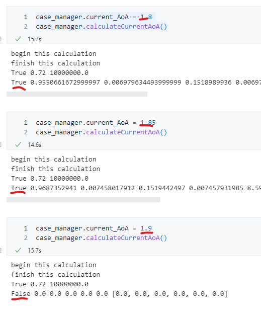

# 发现的问题

我重构了一下代码发现问题如下：

```python
case_manager.current_AoA = 1.8
case_manager.calculateCurrentAoA()

case_manager.current_AoA = 1.85
case_manager.calculateCurrentAoA()

case_manager.current_AoA = 1.9
case_manager.calculateCurrentAoA()
```

则结果为：

```bash
begin this calculation
finish this calculation
True 0.72 10000000.0
True 0.9550661672999997 0.006979634493999999 0.1518989936 0.006979547627999999 8.686208818000001e-08 [0.006961729999999999, 0.00036984600000000006, 0.0008438000000000057, 0.0003698457000000004, 3.3846100000000413e-10, 0.0]

begin this calculation
finish this calculation
True 0.72 10000000.0
True 0.9687352941 0.007458017912 0.1519442497 0.007457931985 8.592172855999999e-08 [0.00946663999999997, 0.00023351750000000053, 0.0007626700000000208, 0.00023351750000000053, 2.906559999999953e-10, 0.0]

begin this calculation
finish this calculation
True 0.72 10000000.0
False 0.0 0.0 0.0 0.0 0.0 [0.0, 0.0, 0.0, 0.0, 0.0, 0.0]
```



我想这是因为高雷诺数会让方程趋于欧拉方程，一般而言在 `CFD` 中有粘性会帮助程序收敛，而高雷诺数表示低粘性，这会导致程序不收敛。因此原来雷诺数设为 20 的时候，大攻角也会让计算收敛；而现在 1e7 的雷诺数，大攻角就不会让程序收敛了。我算了一下这个发散攻角大概在 `1.85` 左右，有必要调整程序。

当然我这里还没有重构完，目前看起来其实不重构直接该 `AoA_max` 设置成 `1.85` 就可以（似乎），但因为源代码个人觉得有点小问题，我正在尝试重写。